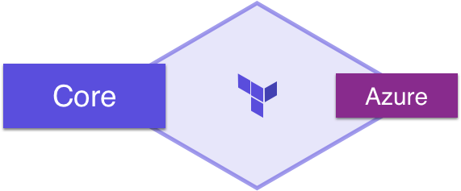
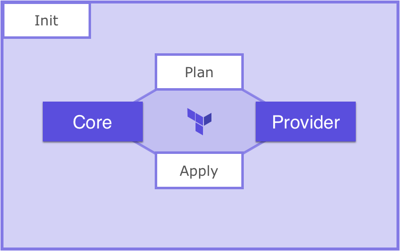
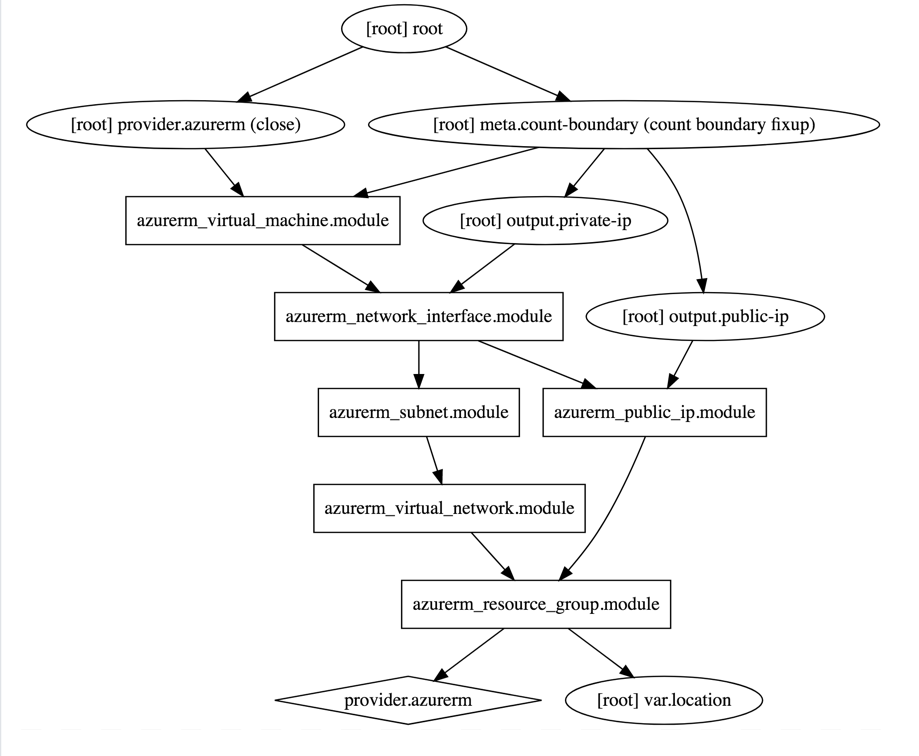
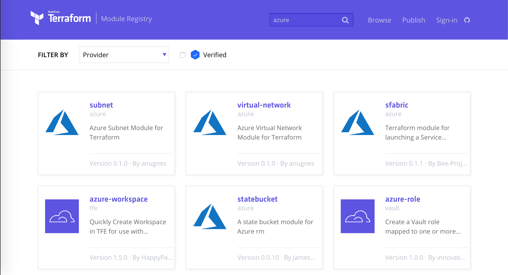
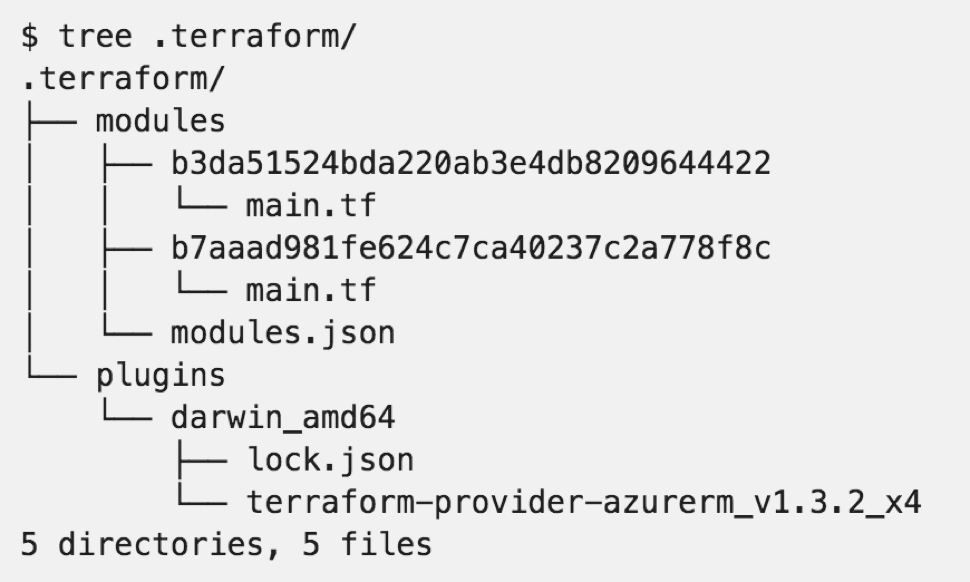

name: Azure-Terraform-Vault-Workshop
class: center,middle,title-slide
count: false

.titletext[
Azure Terraform Workshop]
Build Azure Resources With Infrastructure as Code

???
<!---
Azure Terraform Vault Workshop - Part 1
Terraform for Beginners on Azure

This slide presentation is stored as Markdown code, specifically using the RemarkJS engine to render it. All standard markdown tags are supported, and you can also use some HTML within this document. 

If you need to change the look and feel of the slide deck just use the style.css and remark_settings.js files to suit your needs. The content in this file is picked up by index.html when the page is loaded.

HTML comments like this one will show up in the source code, but not in the slides or speaker notes.
--->

Welcome to the beginner's guide to Terraform on Azure. This slide deck is written entirely in Markdown language, which means you can make edits or additions, then submit a pull request to add your changes to the master copy. To make edits to the slide deck simply fork this repository:  

https://github.com/hashicorp/se-terraform-vault-workshop  

edit the Markdown files, and submit a pull request with your changes.

The Markdown content is contained in the docs/terraform and docs/vault directories.

Here are some helpful keyboard shortcuts for the instructor or participant:  

⬆ ⬇ ⬅ ➡ - Navigate back and forth  
P         - Toggle presenter view  
C         - Pop an external window for presentation

Instructor notes are included in plain text, narrative parts are in **bold**. You can use the narrative quotes or change them to suit your own presentation style. 

---
name: Link-to-Slide-Deck
The Slide Deck
-------------------------
<br><br><br>
.center[
Follow along on your own computer at this link:

https://bit.ly/2x9izst
=========================
]

---
name: Introductions
Introductions
-------------------------

???
Introduce yourself

---
name: Introductions
Introductions
-------------------------
<br><br><br><br><br>
.center[.lab-header[Everyone Stand up]]

???
Have everyone stand up. Then ask those whom to continue standing whom have:
- Used a scripting language
- Used a configuration management/provisioning tool such as puppet/chef/ansible/cloudformation/arm/terraform/etc
- Used a cloud provisioning tool such as cloudformation/arm/terraform
- Used Terraform
- Used Terraform Enterprise

Then ask everyone to sit. Ask anyone to raise their hands if they have used any other HashiCorp tools. Depending on th size of the group, ask them each tool individually, or inquire to the individuals with their hands raised what they have used.

---
name: Table-of-Contents
class: center,middle
Table of Contents
=========================

.contents[
0. Intro to Terraform & Demo
1. Set Up Your Workstation
2. My First Terraform
3. Terraform In Action: plan, apply, destroy
4. Organizing Your Terraform Code
5. Provision and Configure Azure VMs
6. Manage and Change Infrastructure State
]

???
This workshop should take roughly four hours to complete. It is ideal for a half-day workshop and can be paired with Vault content for a full day of training. The infrastructure participants build during the morning session is used as the lab environment for the afternoon session. So you can do a half day of Terraform and/or Vault, or both of them together.

**Here is our agenda for today's training. We'll be taking breaks after each major section or every hour, whichever comes first. This part of the workshop will take us through lunch break, then we'll cover Vault during the afternoon session.**

---
name: How-to-Provision-a-VM
How to Provision an Azure VM
-------------------------
<br><br><br>

Let's look at a few different ways you could provision a new Azure Virtual Machine. Before we start we'll need to gather some basic information including:

.biglist[
1. Virtual Machine Name
1. Operating System (Image)
1. VM Size
1. Geographical Location
1. Username and Password
]

???
**Has anyone got experience using Azure? How do most of us normally get started? That's right, we log onto the Azure Portal and start clicking around. All of the major cloud providers make this part really easy. You get your account, log on and start clicking buttons. Let's take a peek at what that looks like...**

---
name: Azure-Portal-Provision
Method 1: Azure Portal (GUI)
-------------------------


???
**This should look familiar if you've ever used Azure. You click on Virtual Machines, and you'll see a whole list of different base images you can use to provision your VM. Some of these are provided by Microsoft, others are provided by third parties in the marketplace. You either search or browse for the thing you need, and click on it. Easy.**

---
name: Azure-Portal-Provision-2
Method 1: Azure Portal (GUI)
-------------------------


???
**Once you've chosen your base OS image, you will fill in some more details like the size of the VM, which location you want to run it in, and the initial administrator password. The Azure portal can be handy for spinning up individual VMs and dev or test environments. The good news is it's really easy to spin up infrastructure this way. The bad news is that it doesn't scale, and chances are nobody's keeping track of what got built.**

---
name: Azure-Resource-Manager
Method 2: Azure Resource Manager (ARM) Template
-------------------------
```json
{
...
"apiVersion": "2017-03-30",
"type": "Microsoft.Compute/virtualMachines",
"name": "[variables('vmName')]",
"location": "[parameters('location')]",
"dependsOn": [
  "[concat('Microsoft.Network/networkInterfaces/', variables('nicName'))]"
],
"properties": {
  "hardwareProfile": {
    "vmSize": "[parameters('virtualMachineSize')]"
  },
  "osProfile": {
    "computerName": "[variables('vmName')]",
    "adminUsername": "[parameters('adminUsername')]",
    "adminPassword": "[parameters('adminPassword')]"
  }
```

ARM templates provide a consistent and reliable way to provision Azure resources. JSON is easy for computers to read, but can be challenging for humans to edit and troubleshoot.

???
**Which brings us to method #2, Azure Resource Manager templates, also known as ARM templates. Have any of you used ARM templates? What's that experience like?**

**ARM templates are written in JSON, which stands for JavaScript Object Notation. It is an open-standard format for transmitting data between computers. And don't get me wrong, JSON is great. If you happen to be a computer. Computers are really good at reading these files full of key-value pairs and lists.**

**The problem is that editing and maintaining huge JSON files is hard for humans. Because JSON is not a programming language, you'll end up writing a lot more lines of complex code that is hard to understand and change.**

**ARM templates - easy for computers to read, hard for humans to troubleshoot and maintain.**

---
name: Provision-with-Terraform-2
Method 3: Provision with Terraform
-------------------------
<br><br><br>
```terraform
resource "azure_virtual_machine" "web" {
  name     = "MyFirstVM"
  image    = "Windows 2012 R2"
  vm_size  = "Standard DS1"
  location = "East US"
  username = "John Doe"
  password = "YoullNeverGuessThisPassword"
}
```
.center[Example terraform code for building an Azure VM.]

???
**And finally we have option #3, Terraform. Terraform uses a Domain Specific Language, or DSL that is designed to be both human-friendly and machine-readable. This is an example snippet of Terraform code. Now watch as I flip back to the previous slide. Would you rather have to write and maintain this complex and messy JSON, or this simple, compact terraform code?**

Advance back to the previous slide to illustrate the difference between JSON and equivalent Terraform. 

---
name: What-is-Terraform
What is Terraform?
-------------------------


.contents[
* Executable Documentation
* Human and machine readable
* Easy to learn
* Test, share, re-use, automate
* Works on all major cloud providers
]

???
**So what exactly _is_ Terraform? Terraform is the DNA of your hybrid infrastructure. Terraform code is written in HCL, or HashiCorp Config Language. It is the only programming language designed specifically for provisioning infrastructure on any platform.**

**Do any of you have a wiki or set of runbooks that contain provisioning instructions? Think for a moment about that wiki. Now I want you to imagine the date stamp, when was this thing last edited? Let's say it was four years ago. Do you think maybe something could have changed in the past four years?**

**It sounds funny but the truth is your wiki is the obituary of the last known state of your infrastructure. One of the main reasons to use terraform is because it is self-documenting. The code itself explains every step required to build this infrastructure, and therefore it is always up to date.**

---
name: IaC
What is Infrastructure as Code?
-------------------------
<br><br><br>
.biglist[
Infrastructure as Code (IaC) is the process of managing and provisioning cloud infrastructure with machine-readable definition files. 

**Think of it as executable documentation.**
]

???
**You might be thinking...why can't I just do this by hand? After all the Azure portal is really easy, and I can just stand up my infrastructure manually. Here's why:**

**Terraform ensures that when you build any type of infrastructure that it gets built correctly every single time, exactly the same way. Let's try a thought experiment. If I gave every single one of you the same build document and asked you to set up a server, I guarantee there will be differences in those machines when you hand them over. They may not be major differences, but over time these can pile up and cause all sorts of uncertainty and issues in your environment.**

**When you require hands on keyboards (or mice), and you start making changes and manual steps on your infrastructure, you've lost the automation battle before it even starts. Even a single manual step can slow down your delivery schedule, and introduce unnecessary risk and change to your environments.**

---
name: IaC2
Infrastructure as Code Allows Us To...
-------------------------
???
**We sometimes call this philosophy 'Infrastructure as Code', or the practice of expressing all of our provisioning steps as machine-readable code and variables. This is also known as the...**

---
name: IaC2
Infrastructure as Code Allows Us To...
-------------------------
<br><br>
.biglist[
* Provide a codified workflow to create infrastructure
]
???
**...codified workflow. When you code-ify all of your manual steps, you'll gain several advantages that allow you to provision faster, with more efficiency, while reducing risk.**


---
name: IaC2
Infrastructure as Code Allows Us To...
-------------------------
<br><br>
.biglist[
* Provide a codified workflow to create infrastructure
* Change and update existing infrastructure
]
???
**One of the main benefits of IaC is the ability to change and update what you built. There are many tools that allow you to provision infrastructure. This is sometimes called 'Day 0' of operations. The real challenge is managing Day N. What happens when you need to alter the infrastructure you built? Maybe you need to destroy or recreate part or all of it? Are you prepared to maintain and care for this infrastructure, without causing any downtime? Because Terraform is a _stateful_ tool, it can help you keep track of your infrastructure and change it with minimal impact.**

---
name: IaC2
Infrastructure as Code Allows Us To...
-------------------------
<br><br>
.biglist[
* Provide a codified workflow to create infrastructure
* Change and update existing infrastructure
* Safely test changes using **`terraform plan`** in dry run mode
]
???
**Do you remember that scene in the movie Jurassic Park, where Samuel L Jackson turns around and says 'hold onto your butts' as he pushes his untested code change into production? Every sysadmin has had that feeling at one time or another. I really hope this works...**

**What if instead we had a way to safely test every change that went into production with a dry run? What would actually happen if I ran this code right now? Terraform comes with a built in dry run mode that allows you to visualize exactly what would happen if you pushed the apply button right now. This is a valuable tool for sysadmins and operations teams who prize stability and uptime.**

**Unexpected changes in the terraform plan output can be investigated _before_ they go into production.**

---
name: IaC2
Infrastructure as Code Allows Us To...
-------------------------
<br><br>
.biglist[
* Provide a codified workflow to create infrastructure
* Change and update existing infrastructure
* Safely test changes using **`terraform plan`** in dry run mode
* Integrate with application code workflows (Git, Azure DevOps, CI/CD tools)
]

???
**Terraform allows you to automate manual processes and build continuous integration or continuous delivery pipelines. Imagine you had a pipeline for creating hardened machine images. Perhaps you have another pipeline for testing your infrastructure build process. These might be chained to other CI/CD application pipelines where the application is deployed into your tested, hardened infrastructure. Think of API driven infrastructure builds, written in a simple langage everybody can use and understand.**

---
name: IaC2
Infrastructure as Code Allows Us To...
-------------------------
<br><br>
.biglist[
* Provide a codified workflow to create infrastructure
* Change and update existing infrastructure
* Safely test changes using **`terraform plan`** in dry run mode
* Integrate with application code workflows (Git, Azure DevOps, CI/CD tools)
* Provide reusable modules for easy sharing and collaboration
]

???
**As you expand your terraform usage, you'll have certain patterns and pieces of your infrastructure that you'd like to re-use. Maybe you want your network security to be set up a certain way, every time. Or perhaps someone wrote a great Terraform config for your web application. Terraform supports custom modules, which are simply packages of pre-built Terraform code that others can use. You can use Terraform modules to avoid repetition, enforce security, and ensure that standards are followed.**

---
name: IaC2
Infrastructure as Code Allows Us To...
-------------------------
<br><br>
.biglist[
* Provide a codified workflow to create infrastructure
* Change and update existing infrastructure
* Safely test changes using **`terraform plan`** in dry run mode
* Integrate with application code workflows (Git, Azure DevOps, CI/CD tools)
* Provide reusable modules for easy sharing and collaboration
* Enforce security policy and organizational standards
]

???
**Terraform Enterprise also supports policy enforcement. You can create a list of dos and do-nots for your users and ensure that people don't build things they shouldn't, or introduce unnecessary risk into your environments. For example, you may have a policy that states that servers should not be exposed to the public internet. Because all your infrastructure is stored as code, you can quickly analyze that code to see if it's breaking any of the rules, preventing the bad behavior *before* the infrastructure gets built.**

---
name: IaC2
Infrastructure as Code Allows Us To...
-------------------------
<br><br>
.biglist[
* Provide a codified workflow to create infrastructure
* Change and update existing infrastructure
* Safely test changes using **`terraform plan`** in dry run mode
* Integrate with application code workflows (Git, Azure DevOps, CI/CD tools)
* Provide reusable modules for easy sharing and collaboration
* Enforce security policy and organizational standards
* Enable collaboration between different teams
]

???
**Now that all your infrastructure is stored in a source code repository, it's very easy for multiple users and teams to collaborate on it. Developer needs a new feature? He or she can easily adjust the source code and send the change back to the operations folks for review. Terraform is a universal language that is understood by both developers and operations teams.**

---
name: IaC-Tools
Other Infrastructure as Code Tools
-------------------------
<br><br>
.center[]

These tools work well for configuring the operating system and application. They are not purpose-built for provisioning cloud infrastructure and platform services.

???
**Some of you might be thinking, that sounds great but what about this other tool that I use? Why shouldn't I just use Ansible since we already have that? Or my people only do Powershell. These are all great tools. But none of them are specifically designed for provisioning tasks.**

**Chef, Puppet and Ansible all work great in the context of your operating system and applications. It's true that you can do some cloud provisioning with each of these tools, but none of them really work as well as Terraform. And conversely, HashiCorp doesn't have a configuration management tool. Terraform works great with all of these tools.**

---
name: Native-Tools
Native Cloud Provisioning Tools
-------------------------
<br><br><br>
.center[]

Each cloud has its own YAML or JSON based provisioning tool. 

Terraform can be used across *all* major cloud providers and VM hypervisors.

???
**Every major cloud provider has their own JSON or YAML based provisioning tool. But all of them are written in YAML or JSON. And if you learn one of these systems, guess what, the others are completely different. Now if you want to have a multi-cloud strategy you have to learn three separate provisioning systems. With Terraform you are using the same language, the same simple syntax on all three of these cloud providers.**

---
name: Config-Hell
.center[]
???
**This is a fun web comic. Those of you who have spent hours poking at a nested JSON template, trying to figure out which layer of curly braces you are in will understand this...**

---
Name: Terraform-vs-JSON
Terraform vs. JSON
-------------------------
<br><br><br>
ARM JSON:
```json
"name": "[concat(parameters('PilotServerName'), '3')]",
```

Terraform:
```hcl
name = "${var.PilotServerName}3"
```

Terraform code (HCL) is easy to learn and easy to read. It is also 50-70% more compact than an equivalent JSON configuration.

???
1Password did a great blog post illustrating the difference between AWS Cloudformation (JSON) and Terraform. 

https://blog.1password.com/terraforming-1password/

1Password were able to move their entire production infrastructure to Terraform in a few short weeks. Now they can tear down and completely rebuild their production environment in a matter of hours.

---
Name: Why-Terraform
Why Terraform?
-------------------------


???
**Microsoft has invested significant resources to ensure that Azure users have a first-class experience when using Terraform to provision on Azure. Your friendly Microsoft solutions architect is happy to support you if you choose to use Terraform, especially if you are adopting a multi-cloud strategy. Terraform is even built right into Azure CloudShell. You can use Terraform with zero setup, right from your web browser.**

---
Name: Why-Terraform-on-Azure
Why Terraform on Azure?
-------------------------

.contents[
* Supports multi-cloud & hybrid infrastructure
]

???
**Why specifcially should you use Terraform on Azure? The first reason is that Terraform supports your hybrid or multi-cloud strategy. If you need to build some infrastructure on-prem, and some in Azure, Terraform is a natural fit. Your technical staff only has to learn a single language to be able to provision in either environment.**

---
Name: Why-Terraform-on-Azure
Why Terraform on Azure?
-------------------------

.contents[
* Supports multi-cloud & hybrid infrastructure
* Migrate from other cloud providers
]

???
**Terraform is also great for migrating between cloud providers. Let's say you wanted to move some workloads from AWS to Azure. The code changes in Terraform would be much easier to implement than they would via ARM templates. I was able to migrate a simple demo application from one cloud to another in a few short hours, because there was almost no learning curve. Terraform code looks the same no matter where you run it.**

---
Name: Why-Terraform-on-Azure
Why Terraform on Azure?
-------------------------

.contents[
* Supports multi-cloud & hybrid infrastructure
* Migrate from other cloud providers
* Increase provisioning speed
]

???
**It's not unusual to see provisioning times drop from days or weeks to hours or minutes when users adopt Terraform. Ineffective manual steps and change approvals can be replaced with fast code pipelines that have rigorous testing and security built right in. Now instead of waiting for days for a change request to be approved, users can self-provision their infrastructure without bottlenecks or slow approval processes.**

---
Name: Why-Terraform-on-Azure
Why Terraform on Azure?
-------------------------

.contents[
* Supports multi-cloud & hybrid infrastructure
* Migrate from other cloud providers
* Increase provisioning speed
* Improve efficiency
]

???
**Have you heard the saying 'measure twice, cut once?'? Terraform forces your operations teams to be disciplined and consistent with every single build. Have a change or setting that was overlooked during the build? Now you can immediately correct that mistake inside the code, so that a particular step never gets missed again. All future builds will contain the change. This can also improve relations between developers and operations, because the contract is clear. What gets built is always defined in the code, and never left to guesswork or manual processes.**

---
Name: Why-Terraform-on-Azure
Why Terraform on Azure?
-------------------------

.contents[
* Supports multi-cloud & hybrid infrastructure
* Migrate from other cloud providers
* Increase provisioning speed
* Improve efficiency
* Reduce risk
]

???
**Every modern IT organization has to deal with risk. It's a balancing act between security and usability. You can make it so secure nobody can use it, or on the other end you have a free for all where users can do whatever they want, but are putting the entire cloud account in jeopardy due to risky behavior. Terraform allows you to reduce risk by abstracting your users away from the web UI or API. Instead we provide a safe, auditable abstraction layer that lets users get their work done in a secure and safe way, that doesn't grant unnecessary privileged access.**

---
name: Chapter-1
class: center,middle
.section[
Chapter 1  
Intro to Terraform
]

---
name: core-provider
Terraform's Pluggable Model
-------------------------
Terraform code is broken into two parts: Core Terraform, and Providers.

.center[]

*core* = Terraform language, logic, and tooling

*provider* = Pluggable code to allow Terraform to talk vendor APIs

???
**Like all HashiCorp tools, Terraform is designed to be extensible via plugins. In Terraform we call those Providers. Anyone can write their own provider and use it in conjunction with Terraform to manage API addressable resources.**

---
name: anatomy-of-a-resource
Anatomy of a Resource
-------------------------
Every terraform resource is structured exactly the same way.

.center[]

*resource* = top level keyword

*type* = this is the name of the resource. The first part tells you which provider it belongs to. Example: `azurerm_virtual_machine`. This means the provider is Azure and the specific type of resource is a virtual machine.

*name* = arbitrary name to refer to this resource. Used internally by terraform. This field *cannot* be a variable.

???
Everything else you want to configure within the resource is going to be sandwiched between the curly braces. These can include strings, lists, and maps.

---
name: terraform-workflow
Terraform Workflow
-------------------------
Terraform workflow consists of three common commands, Init, Plan, and Apply.

.center[]

*init* = Prepares Terraform

*plan* = Models changes to me made

*apply* = Executes plan

???
Once a terraform configuration has been created, there are three common commands we will use to execute the code. First init which prepares the environment, then a plan, and finally an apply to execute the code.

---
name: provider-block-1
Terraform Provider Configuration
-------------------------
<br><br><br>
Terraform allows you to configure the Providers in the code. You can manually configure which version(s) of a provider you would like to use. If you leave this option out, Terraform will default to the latest available version of the provider.

```hcl
provider "azurerm" {
  version = "=1.30.1"
}
```

???
**Here we have pinned the provider version to 1.30.1. We recommend pinning your provider versions, especially in production.**

---
name: provider-block-2
Terraform Provider Configuration
-------------------------
<br><br><br>
For many providers, including Azure, we can configure authentication methods in the provider block as well. **This is an incredibly dangerous practice: There is almost always a safer way**                                                                                                                                                                                                                                                 
```hcl
provider "azurerm" {
  version = "=1.30.1"

  subscription_id = "SUBSCRIPTION-ID"
  client_id       = "CLIENT-ID"
  client_secret   = "CLIENT-SECRET"
  tenant_id       = "TENANT-ID"
}
```

???
**Don't ever put credentials in code. They *will* get commmitted to version control, and likely exposed**

---
name: provider-auth
Terraform Provider Configuration
-------------------------
<br><br><br>
Terraform will use the native tool's method of authentication. For Azure that can be az login, Managed Service Identity, or environment variables.

```bash
az login
```

```bash
export ARM_TENANT_ID=
export ARM_SUBSCRIPTION_ID=
export ARM_CLIENT_ID=
export ARM_CLIENT_SECRET=
```

???
There are much safer was to pass in authentication information. For our lab today, the shell is already authenticated, however here are some other options to authenticate.

---
name: resources-building-blocks-1
Resources - Terraform Building Blocks
-------------------------
<br><br><br>
Create an Azure Resource Group.

```hcl
resource "azurerm_resource_group" "hashitraining" {
  name     = "training-workshop"
  location = "eastus"
}
```

???
Here is some simple code to create a resource group.

---
name: resources-building-blocks-2
Resources - Terraform Building Blocks
-------------------------
<br><br><br>
Create an Azure Resource Group with a random name.

```hcl
resource "random_id" "project_name" }
  length = 4
}

resource "azurerm_resource_group" "hashitraining" {
  name     = "${random_id.project_name.hex}-training-workshop"
  location = "eastus"
}
```

???
Here is some simple code to create a resource group.
---
name: Live-Demo
class: center,middle
Live Demo
=========================
???
**Let's do a short demo! I'm going to show you how easy it can be to provision infrastructure in Azure. I'll do the demo on one of the workstations that you'll be using for this training.**

NOTE: We tested this in the eastus region and it took around five minutes to build the lab environment. You'll probably want to pre-bake your demo environment and just show the terraform output and Vault server.

Here is some sample dialog you can use for the demo. Keep it short and sweet. Nobody wants a long boring lecture.

**This is a workstation just like the ones you'll be using for today's workshops. I'm going to run a terraform apply command to build out the lab environment. We're actually cheating a little bit here, as we prebaked most of the environment before class to save us some time. Just like your favorite cooking show!**

**You can see the results of the terraform run here in my terminal window. These outputs are showing me the URL of the Vault server I just built. And if we pop over here to the Azure portal you'll see all of the different parts of my lab environment.**

**This is Infrastructure as code. By the end of today's training you'll be able to create your own infrastructure using Terraform.**

**During the morning workshop session each of you will be building a Vault server that you will use after lunch, during the Vault training.**

---
name: chapter-1-exercise
.center[.lab-header[👩🏼‍🔬 Chapter 1: Exercise]]
<br>
### Azure Portal and Cloud CLI
* Login to Azure Portal, start Cloud CLI session, and verify Terraform is installed

https://portal.azure.com  
https://azure.microsoft.com/en-us/free  
https://docs.microsoft.com/en-us/azure/cloud-shell/overview  

`HINT 1: Run Terraform without any other commands for help information.`

---
name: chapter-1-review
📝 Chapter 1 Review
-------------------------
.contents[
In this chapter we:
* Reviewed Terraform workflow
* Connected into Azure Portal and launched Cloud Shell
* Verified that Terraform is available
]

---
name: Chapter-2
class: center,middle
.section[
Chapter 2  
My First Terraform
]

???
**Now that you have terraform installed and working with Azure, we can do a few dry runs before building real infrastructure. Follow along carefully, copying and pasting the commands on each slide into your terminal as we go.**

---
name: terraform-help
Run Terraform Help
-------------------------
Run the **`terraform help`** command in your Terminal:

Command:
```powershell
terraform help
```

Output:
```tex
Usage: terraform [-version] [-help] <command> [args]

  The available commands for execution are listed below.
  The most common, useful commands are shown first, followed by
  less common or more advanced commands. If you're just getting
  started with Terraform, stick with the common commands. For the
  other commands, please read the help and docs before usage.
  
  Common commands:
      plan               Generate and show an execution plan
      graph              Create a visual graph of Terraform resources
      init               Initialize a Terraform working directory
      console            Interactive console for Terraform interpolations
      fmt                Rewrites config files to canonical format
      get                Download and install modules for the configuration
      ...
```
???
**This is a good command to know. Terraform help will reveal all the available subcommands.**

---
name: terraform-init
Run Terraform Init
-------------------------

Command:
```bash
terraform init
```

Output:
```tex
Initializing provider plugins...
- Checking for available provider plugins on https://releases.hashicorp.com...
- Downloading plugin for provider "azurerm" (1.30.1)...

Terraform has been successfully initialized!
```

Terraform fetches any required providers and modules and stores them in the .terraform directory. You can take a peek inside that directory where you'll see the plugins folder.

???
**Terraform has an extendible architecture. You download the core program, terraform, then it fetches plugins and modules that are required for your code.**

---
name: terraform-plan
Run Terraform Plan
-------------------------
When you run **`terraform plan`** you should see output that looks like this:

Command:
```bash
terraform plan
```

Output:
```tex
Terraform will perform the following actions:

  + azurerm_resource_group.hashitraining
      id:       <computed>
      location: "centralus"
      name:     "bugsbunny-workshop"
      tags.%:   <computed>


Plan: 1 to add, 0 to change, 0 to destroy.
```

We are not actually building anything yet. This is just a dry run, showing us what would happen if we applied our change.

---
name: terraform-destroy
Run Terraform Destroy
-------------------------

Command:
```bash
terraform destroy
```

Destroys all resources in the state file.

???
**Terraform provides an easy way to clean up all of the resources it manages.**

---
name: terraform-fmt
Run Terraform Fmt
-------------------------
Command:
```bash
terraform fmt
```

Rewrites all Terraform configuration files in the current working directory.

???
**A huge advance of Terraform is that HCL is a forgiving language unlike JSON or YAML. However there is a correct way to format code. Terraform fmt will automatically correct formating issues in any valid Terraform code.**

---
name: terraform-validate
Run Terraform Validate
-------------------------
Command:
```bash
terraform validate
```

Validate the terraform files in a directory. Validation includes a basic check of syntax as well as checking that all variables declared in the configuration are specified.

???
**Validates the code in the directory.**

---
name: terraform-refresh
Run Terraform Refresh
-------------------------
Command:
```bash
terraform refresh
```

Update the state file of your infrastructure with metadata that matches the physical resources they are tracking.

This will not modify your infrastructure, but it can modify your state file to update metadata. This metadata might cause new changes to occur when you generate a plan or call apply next.


???
**By default Terraform will run a refresh before any plan and apply, but this command is available seperately to update metadata in the state file.**

---
name: terraform-output
Run Terraform Output
-------------------------
Command:
```bash
terraform output
```

Options:
-module=name 	If specified, returns the outputs for a specific 				module 

-json 			If specified, machine readable output will be printed 			in JSON format

???
**Outputs are always shown at the end of a successful apply, however they can be accessed again with the output command**

---
name: terraform-graph-1
Run Terraform Graph
-------------------------
Command:
```bash
terraform graph
```

Outputs the visual execution graph of Terraform resources according to configuration files in DIR (or the current directory if omitted).

The graph is outputted in DOT format.

???
**Terraform automatically manages dependancies, the graph command is very useful for understanding and troubleshooting dependancy issues.**

---
name: terraform-graph-2
Run Terraform Graph
-------------------------
Command:
```bash
terraform graph | dot -Tsvg > graph.svg
```

.center[]

???
**If you have dot installed, you can create a pretty version of this graph easily.**

---
name: terraform-state-1
Run Terraform State
-------------------------
Commands:
```bash
terraform show
```

```bash
terraform state list
```

```bash
terraform state show
```

Display information from the Terraform State file.

???
**Terraform show will display the entire state file, which is often too much information. Terraform state list will display just the list of managed resources, and terraform state show <resource name> will display the information for just one resource.**

---
name: terraform-state-2
Terraform State
-------------------------
Terraform is a _stateful_ application. This means that it keeps track of everything you build inside of a **state file**. You may have noticed the terraform.tfstate and terraform.tfstate.backup files that appeared inside your working directory.

The state file is Terraform's source of record for everything it knows about.

```json
{
  "version": 3,
  "terraform_version": "0.11.13",
  "serial": 6,
  "lineage": "983e6899-96f4-ce60-744e-7123bb1fc315",
  "modules": [
      {
          "path": [
              "root"
          ],
          "outputs": {
              "MySQL_Server_FQDN": {
                  "sensitive": false,
                  "type": "string",
                  "value": "labtest1-mysql-server.mysql.database.azure.com"
```
---
name: terraform-state-3
Terraform State
-------------------------
<br><br>
.biglist[
* **Config:** 	*Desired* State
* **State:** 	*Current* State
* **Diff:** 	*Delta* of {Desired & Current}
* **Plan:** 	*Presents* Diff
* **Apply:** 	*Resolves* Diff
]

???
**The Terraform configuration files are your desired state; the State file is the current state; Diff of those two is the presented in the plan and resolved in the apply.**

---
name: chapter-2-quiz
.center[.lab-header[👩🏼‍🔬 Chapter 2: State Quiz]]

<br>
.center[]

What will happen in each scenario when you run **`terraform apply`**?

???
Queue up the Jeopardy music! Walk through each row and explain the scenario. See if your students can guess what `terraform apply` will do in each situation.

---
name: chapter-2-quiz-answer
.center[.lab-header[👩🏼‍🔬 Chapter 2: Solution]]

<br>
.center[]

It's important to understand how Terraform views code, state, and reality. If you're ever unsure about what will happen you can run **`terraform plan`** to find out.

---
name: chapter-2-exercise-1
.center[.lab-header[👩🏼‍🔬 Chapter 2: Exercise 1]]
### Create Resource Group
* Write Terraform code to create a resource group
* Explicitely state the azurerm provider using the provider syntax

https://www.terraform.io/intro/index.html  
https://www.terraform.io/docs/commands/init.html  
https://www.terraform.io/docs/commands/plan.html  
https://www.terraform.io/docs/commands/apply.html  
https://www.terraform.io/docs/providers/azurerm/r/resource_group.html  
https://www.terraform.io/docs/configuration/providers.html  

`HINT 1: If you want your code to be completely reusable, use random_id to generate unique names. For instance, we could create a resource "random_id" "project_name" and use intepolation to pass ${random_id.project_name.hex} as the input to any name fields. https://www.terraform.io/docs/providers/random/r/id.html`
<br><br><br>
.footnote[.right[[s](https://github.com/chrismatteson/hashicorp_azure_training/tree/master/solutions/exercise1)]]

---
name: chapter-2-exercise-2
.center[.lab-header[👩🏼‍🔬 Chapter 2: Exercise 2]]
### Manage State
* Use Terraform CLI to view all of the state at once. Compare to viewing the state file directly.
* Use Terraform CLI to view the Resource Graph.
* Use Terraform CLI to remove the Resource Group from the state file. Show that a Terraform plan now wants to recreate the Resource Group.
* Use Terraform CLI to import the Resource Group. Show that a Terraform plan does not want to make any changes.
* Use Terraform CLI to taint the Resource Group in the state file. Show that a Terraform plan now wants to recreate the Group. Untaint the Resource Group and show Terraform plan no longer wants to make changes.
* Use Terraform CLI to destroy everything.
* Use Terraform CLI to create just the random_id using target.

https://www.terraform.io/docs/import  
https://www.terraform.io/docs/state/index.html  
https://www.terraform.io/docs/commands  

.footnote[.right[[s](https://github.com/chrismatteson/hashicorp_azure_training/tree/master/solutions/exercise1)]]

---
name: chapter-2-review
📝 Chapter 2 Review
-------------------------
.contents[
In this chapter we:
* Created our first Terraform resource
* Managed a Terraform state file
]

---
name: Chapter-3
class: center,middle
.section[
Chapter 3  
Expressions, Variables, and Outputs
]

???
**In this chapter we'll learn some helpful tools to build reusable Terraform code.**

---
name: expressions-1
Expressions
-------------------------
Powerful tool to reference data from other locations in Terraform code, perform functions, and iterate.

Inside of a string:
```hcl
"${random_id.project_name.hex}-training-workshop"
}
```

Outside of a string:
<br><br>
<=0.11
```hcl
${var.name}
```
\>0.12
```hcl
var.name
```

???
If you followed the hint and used Random_id in the prior exercise, you've already used expressions. This syntax allowed us to take information from one resource and input into another resource.

Prior to 0.12, Terraform had a interpolations as part of HashiCorp Interpolation Language (HIL). Interpolations always had to be encased in a dollar sign and curly braces so Terraform knew to use this other language. With Terraform 0.12 and HCL 2, expressions are a native part of the language, so while the dollar sign curly brace method is still allowd, it's now only required inside of strings.

---
name: expressionss-2
Expressions - Count
-------------------------

Count allows us to create multiple similiar resources without a lot of duplicated code. We can then either use the splat (*) syntax of count.index to reference these dynamic resources.

```hcl
variable "count" {
  default = 2
}
 
resource "azurerm_network_interface" "web" {
  name  = "nic-${count.index}"
  count = var.count
}
 
resource "azurerm_virtual_machine" "web" {
  count                 = var.count
  network_interface_ids = [azurerm_network_interface.web.[count.index].id]
}
```

???
Prior to 0.12, the only way to create multiple resources was using count parameter.

---
name: expressions-3
Expressions - Loops
-------------------------
Terraform 0.12 supports for statements and dynamic blocks within resources.

```hcl
resource "azurerm_virtual_network" "test" {
  name                = "virtualNetwork1"
  location            = "${azurerm_resource_group.test.location}"
  resource_group_name = "${azurerm_resource_group.test.name}"
  address_space       = ["10.0.0.0/16"]
  dns_servers         = ["10.0.0.4", "10.0.0.5"]

  dynamic "subnet" {
    for_each = var.subnets
    content {
      name           = "subnet${subnet.key}"
      address_prefix = subnet.value
    }
  }
}
```

???
Terraform 0.12 has opened up true for loops to create dynamic content both for resources and information inside of resources. In this instance we are dynamically creating subnets based on the population of a list variable.

---
name: expressions-4
Expressions - Conditionals
-------------------------
Terraform supports conditional logic for more flexible code.

```hcl
resource "azurerm_virtual_machine" "web" {
  name                = "${var.prefix}-vm"
  location            = azurerm_resource_group.main.location
  resource_group_name = azurerm_resource_group.main.name
  network_interface_ids = [azurerm_network_interface.main.id]
  vm_size               = var.size == "small" ? var.small_vm : var.large_vm
}
```

???
Terraform interpolation language even supports conditional logic

---
name: expressions-5
Expressions - Math
-------------------------
Expressions even support simple math.

```hcl
resource "azurerm_virtual_machine" "module" {
  name = "myvm-${count.index + 1}"
}

resource "azurerm_virtual_machine" "module" {
  name = format("myvm-%03d", count.index + 1)
}
```

???
Terraform supports basic math functions. If you don't want the numbering to start from zero for instance, you can just add one.

---
name: functions
Built-In Functions
-------------------------
Numerous functions for munging values are built-in.

**concat(list1, list2, ...)** - Combines two or more lists into a single list. 
*concat(var.base_tags, var.additional_tags)*

**element(list, index)** - Returns a single element from a list at the given index.
*element(azurerm_subnet.foo.*.id, count.index)*

**format(format, args, ...)** - Formats a string according to the given format. The syntax for the format is standard sprintf syntax. 
*format("web-%03d", 2).*

???
Terraform includes many helpful functions to munge inputs into the desired format. Here we are combinging two variables with concat, selecting the subnet id which matches the id number of the multiple resources we are creating, and formating a string for a server name to be prefixed by zero.


---
name: chapter-3-exercise-1
.center[.lab-header[👩🏼‍🔬 Chapter 3: Exercise 1]]
### Setup Azure network
* Create a Virtual Network, Subnet, Public IP and Network Interface. Tie them together with interpolation.

https://www.terraform.io/docs/providers/azurerm/r/virtual_network.html  
https://www.terraform.io/docs/providers/azurerm/r/subnet.html  
https://www.terraform.io/docs/providers/azurerm/r/public_ip.html  
https://www.terraform.io/docs/providers/azurerm/r/network_interface.html  
https://www.terraform.io/docs/configuration-0-11/interpolation.html  

`HINT 1: Use a standalone Subnet resource, instead of defining in-line within the Virtual Network resource so we can complete the next exercise.`

`HINT 2: Terraform docs site examples for more complicated resources often include the code for prerequisate resources as well. Sometimes it's easier to copy/paste from the example for the last resource you want to create than starting with the first`
<br><br>
.footnote[.right[[s](https://github.com/chrismatteson/hashicorp_azure_training/tree/master/solutions/exercise2)]]

---
name: chapter-3-exercise-2
.center[.lab-header[👩🏼‍🔬 Chapter 3: Exercise 2]]
### Count
* Update Subnet to use a count of 3. Use count.index to ensure each subnet has a unique address space.

https://www.terraform.io/intro/examples/count.html  
https://www.terraform.io/docs/configuration-0-11/interpolation.html  
<br><br><br><br><br><br><br><br><br><br><br>
.footnote[.right[[s](https://github.com/chrismatteson/hashicorp_azure_training/tree/master/solutions/exercise2)]]

---
name: defining-variables
Variables
-------------------------
Variables provide inputs for Terraform. They can optionally have default values, and types. Variables are reused elsewhere via interpolation.

```hcl
variable "location" {
  default     = "eastus"
  type        = string
  description = "Location to deploy Azure Infrastructure"
}
 
resource "azurerm_resource_group" "module" {
  name     = "my-rg"
  location = var.location
}
```

???
Terraform allows you to create variables to be used as inputs to your code. The ability to add defaults and types provides for more easily reusable code and error handling.

---
name: providing-variables
Where do Variables get their values?
-------------------------
There are numerous ways to pass variables to Terraform

Command line:
```bash
terraform plan -var 'foo=bar'
```

With *terraform.tfvars* file:
```tex
foo = "bar"
valid = true
somelist = [
  "one",
  "two"
]
```

With environment variables:
```bash
export TF_VAR_foo=bar
export TF_VAR_bar=foo
```

???
Choosing an easy and secure method to pass in variables is important to reusing Terraform code. Beyond these options with open source, Terraform Enterprise also has the ability to securely store variables.

---
name: outputs
Outputs
-------------------------
Outputs define useful values that will be highlighted to the user when Terraform applies: 
IP addresses
Usernames
Computed Values

Easily extract and query information from all resources

```hcl
output "vm_private_ips" {
  value       = azurerm_network_interface.app.private_ip_address
  description = "Dynamic Private IP Addresses"
}
```

???
While information about all of the resources could be found in the state file, create outputs makes the information much easier for the user to consume.

---
name: locals
Locals
-------------------------
Locals provide a convienant place to store information.

```hcl
variable "name" {
  default = "dev"
}
 
locals {
  module_name = "${var.name}-sql"
}
```

???
Locals provide a method to store data which doesn't need to be exposed as a variable or data type.

---
name: chapter-3-exercise-3
.center[.lab-header[👩🏼‍🔬 Chapter 3: Exercise 3]]
### Variables
* Create variables.tf file with a variables for Azure location, Tags, and Vault Binary URL.
* Set defaults for each variable as follows:
 * location = eastus
 * tags = {}
 * vault binary url = http://hc-enterprise-binaries.s3.amazonaws.com/vault/ent/1.1.1/vault-enterprise_1.1.1%2Bent_linux_amd64.zip
* Update main.tf file to use Azure location variable for the Resource Group.

https://www.terraform.io/docs/configuration/variables.html  
<br><br><br><br><br>
.footnote[.right[[s](https://github.com/chrismatteson/hashicorp_azure_training/tree/master/solutions/exercise3)]]

---
name: chapter-3-exercise-4
.center[.lab-header[👩🏼  <200d>🔬 Chapter 3: Exercise 3]]
### Outputs
* Create a file called outputs.tf file with an output called "download vault" that the following value which includes the vault_url variable you created in the prior task.

`sudo wget ${var.vault_url} -P /usr/local/bin/vault; sudo chmod 755 /usr/local/bin/vault`

https://www.terraform.io/docs/configuration/outputs.html  
<br><br><br><br><br><br><br><br>
.footnote[.right[[s](https://github.com/chrismatteson/hashicorp_azure_training/tree/master/solutions/exercise3)]]

---
name: chapter-3-exercise-5
.center[.lab-header[👩🏼    <200d>🔬 Chapter 3: Exercise 4]]
### Locals
* Create a local named tags which uses the merge function to merge the tags varaible created in 3.0 with a tag named ProjectName that has the value of your project name.
* Update the Resource Group with the tags local.

https://www.terraform.io/docs/configuration/locals.html  
https://www.terraform.io/docs/configuration-0-11/interpolation.html  
<br><br><br><br><br><br><br><br><br>
.footnote[.right[[s](https://github.com/chrismatteson/hashicorp_azure_training/tree/master/solutions/exercise3)]]

---
name: chapter-3-review
📝 Chapter 3 Review
-------------------------
.contents[
In this chapter we:
* Learned about Variables, Outputs, and Locals
* Updated our Terraform code to include several variables, an output, and local.
]

---
name: Chapter-4
class: center,middle
.section[
Chapter 4  
Organizing Your Terraform Code, Comments, and Data Sources
]

---
name: organizing-your-terraform
Organize Your Terraform Code
-------------------------
.center[]
You should have three files that end in the \*.tf extension on your workstation. The convention is to have a main.tf, variables.tf, and outputs.tf. You may add more tf files if you wish.

* The first file is called main.tf. This is where you normally store your terraform code. With larger, more complex infrastructure you might break this up across several files.
* The second file is called variables.tf. This is where you define your variables and optionally set some defaults.
* The outputs file is where you configure any messages or data you want to show at the end of a terraform apply.

???
Variables.tf, main.tf, outputs.tf is a common convention for organizing Terraform code. It's not required, and more complex code often benifits form being broken down further, but it's a good place to start, and something you're likely to see often.

---
name: comments
Terraform Comments
-------------------------
<br><br>
Terraform supports a few types of comments:

Line Comments begin with an octothorpe<sup>*</sup>, or pound symbol: #. Alternatively a double forward slash can be used.
```hcl
# This is a line comment.
// This is an alternative format for a line comment.
```

Block comments are contained between /\* and \*/ symbols.
```tex
/* This is a block comment.
Block comments can span multiple lines.
The comment ends with this symbol: */
```
<br><br>
.smalltext[
\* Yes, it really is called an [octothorpe](https://www.merriam-webster.com/dictionary/octothorpe).
]

---
name: data-sources
Data Sources
-------------------------

Data Sources allow Terraform to ingest external data.

Enable code reusability by limiting need to hard code settings and replace them with dynamic credentials

Very useful to tie Terraform workspaces together with remote state data sources

Local data sources allow for creating files from templates

```hcl
data "azurerm_image" "search" {
  name                = "search-api"
  resource_group_name = "packerimages"
}

data "terraform_remote_state" "vpc" {
  backend = "remote"
  config = {
    name = "hashicorp/vpc-prod"
  }
}
```

???
Here we have two examples of data sources. The first looks up an image id from azure, while the second load in a terraform state file from a seperate Terraform workspace.

---
name: chapter-4-exercise
.center[.lab-header[👩🏼    <200d>🔬 Chapter 4: Exercise]]
### Data Resources
* Create data source for azurerm_client_config.

https://www.terraform.io/docs/providers/azurerm/d/client_config.html  

### Template File Data Resources
* Download the below code into a file called setupvault.tpl. Then create a data template_file to pass vault_url variable.

[setupvault.tpl](https://raw.githubusercontent.com/chrismatteson/hashicorp_azure_training/master/exercises/exercise4/setupvault.tpl)

https://www.terraform.io/docs/providers/template/d/file.html  

.footnote[.right[[s](https://github.com/chrismatteson/hashicorp_azure_training/tree/master/solutions/exercise4)]]

---
name: chapter-4-review
📝 Chapter 4 Review
-------------------------
.contents[
In this chapter we:
* How to organize our Terraform code
* How to create comments
* How to use Data Sources
]

---
name: Chapter-5
class: center,middle
.section[
Chapter 5 
Modules, Internals, and Backends
]
---
name: modules
Modules
-------------------------
Root module:
	The current working directory when you run terraform init/plan/apply, holding the Terraform configuration files. It is itself a valid module.

Variable scoping:
	Variables are scoped only to the module in which they are declared. There is no inheritance!

```hcl
module "windowsservers" {
  source         = "Azure/compute/azurerm"
  version        = "1.1.5"
  location       = "eastus"
  vm_hostname    = "mywinvm"
  vm_os_simple   = "WindowsServer"
}
```

???
Congradulations! You've already written a module. All Terraform code is reusable as modules. Of course the code you've written so far might not be the most reusable, but Terraform wants to make using modules as easy as possible 

---
name: module-sources
Module Sources
-------------------------
Modules can be stored in many locations:
* Local
* Github
* Generic git repo
* Bitbucket
* HTTP URLs
* Public Registry (support versioning)
* Private Registry (support versioning)

---
name: module-registry
Module Registry
-------------------------
.center[]

???
The public registry provides numerous modules to simplify the code which you need to write. Even if you don't use them as modules, they provide some fantastic examples of how to write high quality Terraform code.

---
name: terraform-internals
Terraform Internals
-------------------------
.center[]
Terraform stores all dependancies for this workspace in a .terraform folder. This way every terraform workspace can have their own, potentially conflicting, dependancies without issue.

???
Terraform dependencies exist under the .terraform folder. The terraform init command is what downloads these dependancies. If you update code to require a new provider or module, you can run terraform init again. It's always safe to just delete the .terraform folder as well and run terraform init again.

---
name: backends
Terraform Backends
-------------------------
Determines how state is loaded and how an operations are executed.

Enables non-local file state storage, remote execution, etc.

By default, Terraform uses the "local" backend. Other supported backends include Consul, Azure Storage Accounts, Artificatory, Terraform Enterprise, and much more.

```hcl
terraform {
  backend "azurerm" {
    storage_account_name = "myorgeastus8x76ghf"
    container_name       = "terraformstate"
    key                  = "dev.terraform.tfstate"
  }
}
```

???
We've already seen the power of the state file, so of course we don't want to lose something this important. Additionally if we want to collaborate with our peers, we need somewhere to share state files and provide locking to ensure multiple people are not simultaniously updating the state file. So far we've been using the "local" backend.

Of the many backends supported, one is azure storage accounts, which provide a simple mechanism inside of Azure to store state files. Once we add this statement to our terraform code, we can use Terraform init to copy the state file to the new backend.

The Azure marketplace also includes a VM and storage account already setup to use as a bastion host for managing your Terraform code. In an all Azure environment is this a simple way to get quickly setup in a best practice format.

Additionally, HashiCorp now offers the HashiCorp Cloud as a free option to store your state file. Essentially a light version of Terraform Enterprise, this provides you the ability to store state files in the cloud, gets around the chicken and the egg problem of setting up state file storage outside of Terraform, and provides a UI for managing worksspaces.

---
name: chapter-5-exercise-1
.center[.lab-header[👩🏼‍🔬 Chapter 5: Exercise]]
### Modules
* Create a subfolder called "modules" and another subfolder called "networking"
* Write a variables.tf, main.tf, and outputs.tf file in this folder and move the code for all of the azure networking components from the root module into here.
* Write module code in the root module to call this new module and remove the networking code from the root.

https://www.terraform.io/docs/configuration/modules.html

`HINT 1: Use variables to pass in information regarding the resource group and project_name`

`HINT 2: Create an outputs for network_interface id and public_ip ip_address to be used in a later exercise.`

.footnote[.right[[s](https://github.com/chrismatteson/hashicorp_azure_training/tree/master/solutions/exercise5)]]

---
name: chapter-5-exercise-2
.center[.lab-header[👩🏼‍🔬 Chapter 5: Exercise]]
### Virtual Machine
* Create an Azure Virtual Machine to use the resource group, network interface, and template_file as custom_data, which were created in prior exercises.
* Add the MSI virtual machine extension to the VM.

https://www.terraform.io/docs/providers/azurerm/r/virtual_machine.html  
https://www.terraform.io/docs/providers/azurerm/r/virtual_machine_extension.html  
https://docs.microsoft.com/en-us/azure/active-directory/managed-identities-azure-resources/overview  

`HINT 1: Use vm_size Standard_A2_v2.`

`HINT 2: Use the publisher "Microsoft.ManagedIdentity", the type "ManagedIdentityExtensionForLinux" and type_handler_version "1.0"`

.footnote[.right[[s](https://github.com/chrismatteson/hashicorp_azure_training/tree/master/solutions/exercise6)]]

---
name: chapter-5-exercise-3
.center[.lab-header[👩🏼‍🔬 Chapter 5: Exercise]]
### MySQL Server
* Create a managed MySQL Server Instance and Database. Create a new random_id to provide the password.
* Create a firewall rule to allow access from the public IP of our virtual machine

https://www.terraform.io/docs/providers/azurerm/r/mysql_server.html  
https://www.terraform.io/docs/providers/azurerm/r/mysql_database.html  
https://www.terraform.io/docs/providers/azurerm/r/mysql_firewall_rule.html  
<br><br><br><br><br><br><br><br>
.footnote[.right[[s](https://github.com/chrismatteson/hashicorp_azure_training/tree/master/solutions/exercise6)]]

---
name: chapter-5-exercise-4
.center[.lab-header[👩🏼‍🔬 Chapter 5: Exercise]]
### Add Useful Output
* Add outputs for to ease using the Terraform code.
 * Configure Vault: `export VAULT_ADDR=http://${module.networking.public_ip}:8200`
 * SQL Server FQDN: `${azurerm_sql_server.postgresql.fqdn}`
 * SQL Server Username/Password: `${azurerm_postgresql_server.sql.administrator_login}\\${azurerm_postgresql_server.sql.administrator_login_password}`
 * Subscription ID: `${data.azurerm_client_config.current.subscription_id}`
 * Resource Group Name: `${azurerm_virtual_machine.main.resource_group_name}`
 * VM Name: `${azurerm_virtual_machine.main.name}`
 * JWT Token: `curl http://localhost:50342/oauth2/token?resource=https://management.azure.com -H metadata:true | jq .access_token | tr -d '\"'`

https://www.terraform.io/docs/configuration/outputs.html

.footnote[.right[[s](https://github.com/chrismatteson/hashicorp_azure_training/tree/master/solutions/exercise6)]]

---
name: chapter-5-review
📝 Chapter 5 Review
-------------------------
.contents[
In this chapter we:
* Learned about modules
* Learned about Terraform Internals
* Learned abou Terraform backends
* Implimented a new module
]

---
name: Chapter-6
class: center,middle
.section[
Chapter 6  
Terraform Enterprise - Built for Teams and Organizations
]

---
name: why-tfe-1
Terraform Enterprise
-------------------------
.center[]

Terraform Enterprise is a SaaS or on-premise application that provides the following features:

???
**Until now we've been using only open source features. Sooner or later you'll reach a point where you want more tools for governance and collaboration. Terraform open source is great for small environments and developers, but when you need multiple people or teams to collaborate on the same infrastructure, Terraform Enterprise features can help.**

---
name: why-tfe-2
Terraform Enterprise
-------------------------
.center[]

Terraform Enterprise is a SaaS or on-premise application that provides the following features:

* Easy Mode - UI integration with Version Control System

???
**As your organization begins to standardize on Terraform, you'll have different types of users. Most of you will become terraform experts, but there may be others who just want to build things. They can use the terraform code that folks like you have written. To make this process easy, we have a web application. You log on, click a button, and out pops your infrastructure.**

---
name: why-tfe-3
Terraform Enterprise
-------------------------
.center[]

Terraform Enterprise is a SaaS or on-premise application that provides the following features:

* Easy Mode - UI integration with Version Control System
* Advanced Users - API driven workflow with CI/CD pipeline

???
**For our more advanced users we have a fully featured RESTful API. This is useful for programmatic access to terraform features. You can drive terraform plan and apply commands using an API interface. If you have a CI/CD pipeline you can automate your terraform builds as part of your process.**

---
name: why-tfe-4
Terraform Enterprise
-------------------------
.center[]

Terraform Enterprise is a SaaS or on-premise application that provides the following features:

* Easy Mode - UI integration with Version Control System
* Advanced Users - API driven workflow with CI/CD pipeline
* Centralized Terraform state management

???
**Terraform enterprise also provides safe and secure storage for your state files. Instead of having that important state file stored on someone's laptop, now it is safely stored in the Terraform Enterprise application. Only those who need access to the state file can see it, and it is protected from being overwritten or corrupted.**

---
name: why-tfe-5
Terraform Enterprise
-------------------------
.center[]

Terraform Enterprise is a SaaS or on-premise application that provides the following features:

* Easy Mode - UI integration with Version Control System
* Advanced Users - API driven workflow with CI/CD pipeline
* Centralized Terraform state management
* Private Module Registry for sharing code

???
**Eventually you'll have a library of Terraform code that you might like to share and publish for other users and teams in your company. The private module registry makes this easy. You build reusable modules that build infrastructure according to standards, and then publish them for your users. This can help with enforcing security policies and build standards.**

---
name: why-tfe-6
Terraform Enterprise
-------------------------
.center[]

Terraform Enterprise is a SaaS or on-premise application that provides the following features:

* Easy Mode - UI integration with Version Control System
* Advanced Users - API driven workflow with CI/CD pipeline
* Centralized Terraform state management
* Private Module Registry for sharing code
* Sentinel policy enforcement

???
**TFE also comes with a policy enforcement engine that can ensure that your users don't build things they shouldn't build, or configure them in the wrong way. For example, you might wish to prevent users from opening network ports to the internet, or from building too many virtual machines. All of these types of rules can be expressed using our Sentinel policy enforcement engine. Sentinel policies prevent users from doing bad things, *before* they provision to the cloud.**

---
name: why-tfe-7
Terraform Enterprise
-------------------------
.center[]

Terraform Enterprise is a SaaS or on-premise application that provides the following features:

* Easy Mode - UI integration with Version Control System
* Advanced Users - API driven workflow with CI/CD pipeline
* Centralized Terraform state management
* Private Module Registry for sharing code
* Sentinel policy enforcement
* Single Sign-On with SAML

???
**Terraform Enteprise also supports single sign-on using your own SAML provider. This allows you to quickly map users into your organization's teams and workspaces so they can become productive right away.**

---
name: why-tfe-8
Terraform Enterprise
-------------------------
.center[]

Terraform Enterprise is a SaaS or on-premise application that provides the following features:

* Easy Mode - UI integration with Version Control System
* Advanced Users - API driven workflow with CI/CD pipeline
* Centralized Terraform state management
* Private Module Registry for sharing code
* Sentinel policy enforcement
* Single Sign-On with SAML
* Secure variable and API key management

???
**Terraform enterprise can store and encrypt your cloud credentials, passwords or any other sensitive data. These credentials are stored safely inside of a Vault instance that runs inside of TFE.**

---
name: tfe-terraform-cloud-enterprise
Terraform Cloud or Terraform Enterprise?
-------------------------
<br><br><br>
**[Terraform Cloud](https://app.terraform.io/signup)** is a hosted application that provides features like remote state management, API driven runs, policy management and more. Many users prefer a cloud based SaaS solution because they don't want to maintain the infrastructure to run it.

**[Terraform Enterprise](https://www.hashicorp.com/go/terraform-enterprise)** is the same application, but it runs in your cloud environment or data center. Some users require more control over the Terraform Enterprise application, or wish to run it in restricted networks behind corporate firewalls.

The feature list for these two offerings is nearly identical. We will be using Terraform Cloud accounts for our lab exercises today.*

???
At the instructor's discretion, this course can also be taught with an on-prem Terraform Enterprise server. We highly recommend sticking to the cloud based training though, to avoid any blockers or issues in the enterprise...

---
name: tfe-terraform-cloud-signup
Sign Up for a Free Account
-------------------------
.center[]

.center[Visit the signup page for Terraform Cloud:]

.center[https://app.terraform.io/signup/account]

???
**Go ahead and sign up for a new account if you don't have one already. Once you've signed up wait for more instructions.**

---
name: tfe-create-an-org
Create an Organization
-------------------------
.center[]

Create a new organization. Name it with a prefix which the instructor will provide and your name **prefix-yourname**. We'll be using this later in the training.

???
**Okay, now everybody should create a new organization. Write those down too so I can upgrade them to trial organizations. This will just take a moment.**

Instructors, provide a unique prefix based on the course for everyone to include in their organization name. Then ask students to provide you their organization names. You'll need to go into the admin console and upgrade them all to trial organizations.

---
name: why-remote-state
Why Remote State?
-------------------------
<br>
```tex
  "primary": {
      "id": "/subscriptions/14692f20-9428-451b-8298-102ed4e39c2a/resourceGroups/seanclab-workshop/providers/Microsoft.Network/networkInterfaces/seanclab-catapp-nic",
      "attributes": {
          "applied_dns_servers.#": "0",
          "dns_servers.#": "0",
```


Terraform stores information about the resources it has built in a **state file**. This important file contains all of the data that terraform needs to change, update, and delete infrastructure. The local state file has some disadvantages:

* Sometimes contains secrets or sensitive data
* Can't collaborate because the file is on someone's laptop
* Risk of losing or deleting the state file
* No centralized record keeping

Let's migrate our local state file into Terraform Cloud where it will be encrypted and protected from unauthorized access.

---
name: tfcloud-remote-state
Terraform Cloud Remote State
-------------------------
Terraform Cloud Remote State is free and available to all users. The requirements to get it set up and working are:

* Free or paid Terraform Cloud account
* A **.terraformrc** (Unix/Linux) or **terraform.rc** (Windows) config file
* User access token stored in your config file
* Remote backend config file, name it **remote_backend.tf** for convenience.

```hcl
credentials "app.terraform.io" {
  token = "REPLACE_ME"
}
```
```hcl
terraform {
  backend "remote" {
    hostname = "app.terraform.io"
    organization = "ORGNAME"
    workspaces {
      name = "YOURWORKSPACE"
    }
  }
}
```

???
**You need two config files to get remote state working. First is your .terraformrc (or terraform.rc on Windows), and the second is a remote_backend.tf with the terraform block of code in it. The credentials file holds your token, while the config file tells terraform where to store your state file.  We'll be creating these two files in a moment.**

---
name: change-to-local-exec
Remote vs Local Execution
-------------------------
.center[]

TFE supports both local and remote execution. This setting can be configured under **General** settings for your workspace.

???
Local executation occurs on your local laptop and Terraform Enterprise is only used to store the state file. Remote execuation occurs on the Terraform Enterprise servers. The greatest advantage of remote execuation is the ability to seperate your local internet access and local credentials from the Terraform run.

---
name: chapter-6-exercise-1
.center[.lab-header[👩🏽‍🔬 Chaper 6: Exercise 1]]
### Create Terraform Enterprise User and Organization
* Create a Terraform Enterprise trial account. The instructor will provide you with a link to create a 30 day trial.
* Create a new organization, make sure to include the provided prefix in the name
* Create an API key for your user
* Provide the name of the organization to the instructor

https://app.terraform.io/signup/account
https://www.hashicorp.com/resources/why-consider-terraform-enterprise-over-open-source  
https://www.hashicorp.com/resources/getting-started-with-terraform-enterprise  
https://www.terraform.io/docs/enterprise/users-teams-organizations/users.html  
<br><br><br><br><br><br><br><br>
.footnote[.right[[s](https://github.com/chrismatteson/hashicorp_azure_training/tree/master/solutions/exercise7)]]

---
name: chapter-6-exercise-2
.center[.lab-header[👩🏽‍🔬 Chaper 6: Exercise 2]]
### Remote State
* Configure a .terraformrc file with the token created in the last task
* Create a terraform.tf file with remote backend configuration
* Run terraform init and copy state file to new backend
* Move old terraform.state file out of the directory
* Login to Terraform Enterprise and see the new workspace
* Change workspace to local execution
* Run a terraform apply and see that it's executed locally

https://www.terraform.io/docs/commands/cli-config.html  
https://www.terraform.io/docs/backends/types/remote.html  
<br><br><br><br><br><br><br><br>
.footnote[.right[[s](https://github.com/chrismatteson/hashicorp_azure_training/tree/master/solutions/exercise7)]]

---
name: chapter-6-review
📝 Chapter 6 Review
-------------------------
<br>
.contents[
In this chapter we:
* Reviewed the value Terraform Enterprise offers
* Looked at Terraform Cloud and Enterprise
* Signed up for a Terraform Cloud account
* Created a new organization
* Learned about Remote State
* Generated a Terraform Cloud Token
* Configured our terraform.rc file
* Enabled the remote state backend
* Migrated our state to TF Cloud
]

---
name: Chapter-7
class: center,middle
.section[
Chapter 7  
Protecting Sensitive Variables
]

---
name: where-are-your-creds
Where Are Your API Keys?
-------------------------
Terraform requires credentials in order to communicate with your cloud provider's API. These API keys should never, ever be stored directly in your terraform code. Config files and environment variables are a better option, but the credentials still live on your workstation, usually stored in plaintext.

```tex
Name                           Value
----                           -----
ARM_CLIENT_SECRET              3an0t438-63d8-ed89-225b-d0fv41ld70ab
ARM_SUBSCRIPTION_ID            14692f20-9428-451b-8298-102f4ke39c2a
ARM_TENANT_ID                  0e3e2e88-8caf-41ca-b4da-e3b33b6c52ec
ARM_CLIENT_ID                  91299f64-f951-4462-8e97-9efb1d215501
```

For this workshop, a service principal with appropriate credentials has been provided.

???
**Note how our API keys are just sitting there in plain text. This isn't the most secure way to build cloud resources.**

---
name: a-better-way-creds
A Better Way to Store Sensitive Data
-------------------------
.center[]

Terraform Cloud can safely store your credentials and encrypt them for you. You can use this encrypted storage for passwords, TLS Certificates, SSH keys or anything else that should not be lying around in plain text. 

???
**Before we store our sensitive variables in Terraform Enterprise, we must enable Remote Execution.**

---
name: enable-remote-execution
Enable Remote Execution
-------------------------
<br><br>
.center[]

Before we migrate our sensitive API credentials into the application we need to enable remote execution. Under the **General** settings for your workspace, change the Execution Mode to **Remote**. Click the **Save Settings** button at the bottom of the page.

???
**When remote execution is enabled, all of your variables are stored in Terraform Enterprise, and the `terraform plan` and `terraform apply` commands now happen on the server instead of on your workstation. State is still stored remotely as before. Your command line simply becomes a tool for driving the remote execution.**

---
name: chapter-7-exercise
.center[.lab-header[👩🏻‍🏫 Chapter 7: Exercise 1]]
### Provide API Credentials
Create Terraform Cloud **environment variables** for your Azure credentials. Make sure the `ARM_CLIENT_SECRET` is marked as **sensitive**. Reference the credentials document shared at the beginning of the workshop for these credentials.

```tex
Name                           Value
----                           -----
ARM_CLIENT_SECRET              3an0t438-63d8-ed89-225b-d0fv41ld70ab
ARM_SUBSCRIPTION_ID            14692f20-9428-451b-8298-102f4ke39c2a
ARM_TENANT_ID                  0e3e2e88-8caf-41ca-b4da-e3b33b6c52ec
ARM_CLIENT_ID                  91299f64-f951-4462-8e97-9efb1d215501
```

HINT: You'll need to find the **Environment Variables** section of your workspace settings.

### Initiate a Plan/Apply
Kick off a run in the using the **Queue Plan** button. Watch the results of your run in the UI.

---
name: chapter-7-review
📝 Chapter 7 Review
-------------------------
<br>
.contents[
In this chapter we:
* Viewed our Azure Credentials
* Enabled Remote Execution
* Moved our Azure Creds to TF Cloud
* Ran Terraform Apply from the GUI
]

---
name: Chapter-8
class: center,middle
.section[
Chapter 8  
Sentinel Policy Enforcement
]

---
name: what-is-sentinel
What is Sentinel?
-------------------------
```hcl
# Restricting region in AWS
aws_region_valid = rule {
  all region_values as rv {
	rv == "us-east-1"
  }
}
# Restricting machine types in GCP
allowed_machine_types = [
  "n1-standard-1",
  "n1-standard-2",
  "n1-standard-4",
]
# Restricting publisher in Azure
allowed_publishers = [
  "MicrosoftWindowsServer",
  "RedHat",
]
```

Sentinel is HashiCorp's policy enforcement language. Sentinel policies are checked after **`terraform plan`** is run. Sentinel will intercept bad configurations *before* they go to production, not after. 

Sentinel rules help enforce compliance and security requirements in the cloud.

???
**Think of all the dos and do-nots that you want to enforce in your cloud environments. Maybe you want to limit the sizes of virtual machines, or to force web applications to always use SSL. Sentinel rules can be customized for most common security and compliance requirements.**

Talk about Sentinel and some other things you can do with it.

---
name: enable-workspace-destroy
Enable Workspace Destroy
-------------------------
For the next exercise we'll need to destroy and recreate your environment. Terraform Cloud requires a special environment variable to enable destruction of infrastructure.

.center[]

Create a new Environment Variable named **`CONFIRM_DESTROY`** and set the value to **`1`**.

???
**This is a safety switch, it's there to prevent us from shooting ourselves in the foot and deleting production.**

---
name: chapter-8-exercise
.center[.lab-header[👩🏻‍🏫 Chapter 7: Exercise 1]]
### Destroy Workspace
* Add `CONFIRM_DESTROY` environment variable to your workspace.
* Either from the command line, or the GUI, destroy your workspace. 

https://www.terraform.io/docs/enterprise/workspaces/settings.html#destruction-and-deletion

`HINT 1: Do not click the red Destroy from Terraform Enterprise button. This will delete your entire workspace. Remember to confirm the destroy action from within the UI.`

### Create a New Sentinel Policy
* Create new Sentinel policy called**restrict_allowed_vm_types**.
* Copy the following Sentinel code into your policy: (restrict_allowed_vm_types.hcl)[https://raw.githubusercontent.com/chrismatteson/hashicorp_azure_training/docs/exercises/exercise7/restrict_allowed_vm_types.hcl]
* Create a new policy set that applies to your workspace 
* Add the **restrict_allowed_vm_types** policy you created in the previous step to your policy set.

https://www.terraform.io/docs/enterprise/sentinel/index.html
https://www.terraform.io/docs/enterprise/sentinel/manage-policies.html

---
name: create-your-application
Re-deploy Your Application
-------------------------
Command Line:
```bash
terraform apply -auto-approve
```

Output:
```tex
Organization policy check:

Sentinel Result: false

Sentinel evaluated to false because one or more Sentinel policies evaluated
to false. This false was not due to an undefined value or runtime error.

1 policies evaluated.

## Policy 1: block_allow_all_http.sentinel (hard-mandatory)

Result: false

  FALSE - block_allow_all_http.sentinel:23:70 - sr.access == "Deny"
*Error: Organization policy check hard failed.
```
Oh no! Our **`terraform apply`** failed. How can we fix our code?

---
name: chapter-8-exercise
.center[.lab-header[👮🏿‍♀️ Lab Exercise 6: Secure the App]]
<br><br>
The security team has a new requirement: Development applications should not be exposed to the public Internet.

We have implemented a policy that disallows **`0.0.0.0`** or **`*`** as the **`source_address_prefix`** in Azure network security group rules that apply to port 80.

Fix the code on your local workstation so that it passes the Sentinel check. Run Terraform apply to limit dev environment access to your workstation's source IP address.

**HINT:** You can use this Powershell command to get your workstation's public IP address:
```powershell
(Invoke-WebRequest -UseBasicParsing http://icanhazip.com).content
```

You may also simply type "What is my IP address?" into your browser search bar.

???
**I'm going to keep the organization view up here on the projector screen. Let's see how fast everyone can get their code compliant and have a clean terraform apply.**

Instructors: Have fun with this exercise. Pull up your organization's homepage on the projector screen. You can make a game out of it, see who gets their code compliant first.

---
name: chapter-8-review
📝 Chapter 8 Review
-------------------------
<br>
.contents[
In this chapter we:
* Destroyed our Application
* Enabled a Sentinel Policy
* Watched our Terraform Code Fail
* Fixed the Code to Pass Sentinel Tests
* Verified the New Policy
]

---
name: Chapter-9
class: center,middle
.section[
Chapter 9  
Version Control Systems and Terraform
]

---
name: whats-a-vcs
What is a Version Control System (VCS)?
-------------------------
.center[]
Version control systems are applications that allow users to store, track, test, and collaborate on changes to their infrastructure and applications. Terraform Enterprise integrates with most common Version Control Systems.

---
name: tfe-infra-as-code-workflow
Infrastructure as Code
-------------------------
<br><br>
Terraform Enterprise can directly integrate with source code repos in Github Enteprise, Gitlab, and Bitbucket. This allows you to build simple devops workflows with code reviews, testing and approvals.

Until now all our code changes have been done on our workstation. Let's upgrade our workspace to use the repository fork we created earlier. 

???
TODO: Add an image to this slide.

---
name: vcs-driven-workflow
Collaboration With VCS
-------------------------
.center[]

When your Terraform code is stored in a version control system, you unlock extra features like pull requests, code reviews and testing. Here's an example showing the tests that run on our training lab repo.

You can configure rules like requiring tests to pass, code reviews, approvals and more. Let's do a code collaboration exercise.

---
name: chapter-8-review
📝 Chapter 8 Review
-------------------------
.contents[
In this chapter we:
* Reviewed VCS workflow for Terraform
* Disucssed collaboration via VCS
]

---
name: Chapter-9
class: center,middle
.section[
Chapter 9  
Access Controls
]

---
name: terraform-rbac
Role Based Access Controls (RBAC)
-------------------------
.center[]

In the previous chapter we made a change by merging a code change into the source code repo. Your users can also collaborate within the Terraform UI. 

Terraform Enterprise is a multi-tenanted application that supports fine-grained access controls. You can create multiple organizations, each containing its own teams and users.

???
TODO: Find a better image for this slide.

---
name: chapter-9-exercise
.center[.lab-header[👭 Lab Exercise 9a: Share the Sandbox]]
### Role Based Access Control
This is a partner exercise. In this lab you'll invite your partner to your organization.

**Partner 1**:
1. Go into your organization's team settings and create a new team called **developers**. 
2. Visit your workspace's **Team Access** menu and grant **write** access to your developers team.
3. Invite your partner to your organization's **developers** team.

**Partner 2**:
Verify that you are able to see your partner's organization and workspace.

Trade roles and repeat the lab exercise.

---
name: chapter-9-review
📝 Chapter 9 Review
-------------------------
<br>
.contents[
In this chapter we:
* Created a new team for developers
* Granted devs write access to our workspace
* Added our partner to the devs team
]

---
name: before-you-go
Before You Go...
-------------------------
Please run **`terraform destroy`** command to delete your lab environment(s) before you go. This helps us keep our cloud costs under control.

Command:
```bash
terraform destroy
```

Output:
```tex
Do you really want to destroy all resources?
  Terraform will destroy all your managed infrastructure, as shown above.
  There is no undo. Only 'yes' will be accepted to confirm.

  Enter a value: yes

Destroy complete! Resources: 15 destroyed.
```

---
name: Feedback-Survey
Workshop Feedback Survey
=========================
<br><br>
.center[
Your feedback is important to us! 

The survey is short, we promise:

https://www.surveymonkey.com/r/TerraformTraining
=========================
]

---
name: additional-resources-tfe
Additional Resources
-------------------------
If you'd like to learn more about Terraform Enterprise visit the links below:

Terraform Enterprise Product Page
https://www.hashicorp.com/products/terraform/

Why Consider Terraform Enterprise Over Open Source?
https://www.hashicorp.com/resources/why-consider-terraform-enterprise-over-open-source

Terraform Enterprise Docs
https://www.terraform.io/docs/enterprise/index.html

Terraform Azurerm Provider Documentation  
https://www.terraform.io/docs/providers/azurerm/

Link to this Slide Deck  
https://bit.ly/2x9izst
